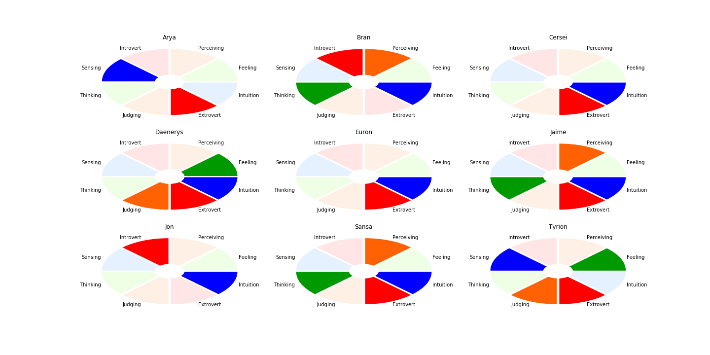

# How to fake you have watched Game of Thrones using a Fake News Classifier, Sentiment Analysis and some heuristical considerations on psychology
I haven't watched Game of Thrones. Not a single episode, not even a small sequence. So my only resource, if I want to be socially able to have a discution about GOT, is Data Science.
In this project, I am doing the psychological portrait of the Game Of Thrones characters based only on how are they talked about. For this purpose, I have performed analytics on tweets abot the GOT characters. My choice for describing the psychological type is the [Myers-Briggs Indicator](https://en.wikipedia.org/wiki/Myers%E2%80%93Briggs_Type_Indicator)
The Myers-Briggs Indicator takes into accout four axes:
* __E__ xtraversion <-> __I__ ntroversion
* __S__ ensing <-> i __N__ tuition
* __T__ hinking <-> __F__ eeling
* __J__ udging <-> __P__ erceiving

The repository contains:
* __download_tweets.py__ script for downloading tweets about Game of Thrones characters, following the method described by Marco Bonzanini on his blog. Strongly suggest to buy [his book](https://www.amazon.de/Mastering-Social-Mining-Python-English/dp/1783552018)
* __Sentiment_LSTM-GloVe.ipynb__ is a classifier for Sentiment Analysis, with LSTM on top of GloVe pretrained embedding. I have used the _imdb_full_ dataset and got 88.5% accuracy
* __FakeNews-logistic regression.ipynb__ is a classifier to detect fake news consisting of a Logistic Regression classifier with Naive Bayes TF-IDF features similar with what [Jeremy Howard has done on Kaggle for the Toxic Comment Competition](https://www.kaggle.com/jhoward/nb-svm-strong-linear-baseline). It is a bit overfitting, nevertheless we got 95% accuracy on the test set, while using the same method as we used for the sentiment analysis has provided 93% accuracy. I learned about the fact there is a dataset from a [blogpost by Katherine Jarmul](https://blog.kjamistan.com/comparing-scikit-learn-text-classifiers-on-a-fake-news-dataset/)
* __analysis.ipynb__ is the notebook where all the magic is done. Based on the results from the Sentiments Analysis and Fake News Classifier. as well as some exploratory analysis on things like the retweeting rate, all the conclusions on the Briggs-Myers profiles of the GOT characters are drawn.

Of course, there are plenty of people who have actually watched GOT and wrote articles on the Briggs-Myers personality types of the characters; they tend to disagree and there are plenty of discuttions on dedicated forums, and one can expect this from fictional characters who have never took a professional psychological test. Nevertheless, I used their expert opinion to validate my approach.

* Arya: ESxx - can be Provider, Supervisor, Performer, Provider (ESFP on the internet)
* Bran: INTP -Architect (INFP on the internet)
* Cersei: ENxx - can be Champion, Teacher, Inventor, Fieldmarshal (ENTJ on the internet)
* Daenerys: ENFJ -Teacher (INFJ on the intrnet)
* Euron: ENxx - can be Champion, Teacher, Inventor, Fieldmarshal (ENTJ on the internet)
* Jaime: ENTP -Inventor (ESTP on the internet)
* Jon: INxx - can be Counselor, Architect, Mastermind, Healer (INFJ on the internet)
* Sansa: ENTP - Inventor (ESFJ on the internet)
* Tyrion: ESFJ -Provider (ENFP on the internet)

## Conclusions
One can use indirect sources to do psychological portraits: we were able to assign 28 out of 36 labels, about 77%. 21 out of these 28 tags semm to be correctly assigned, which provide an accuracy of 75%. We were able to classify the extraversion vs introversion and the sensing vs intuition for each character with 87.5% accuracy with 88% accuracy on the former. The other two dimensions, thinking vs feeling and judging vs perceiving were harder to solve; for almost half of the characters, we were not able to provide an answer and the precision was only slightly greater than guessing (60% for each of the axes).
In discuttions about GOT, I will say that Bran is my favourite character because I am an INTP myself. A more techical conclusion is that Naive Bayes features really work.
